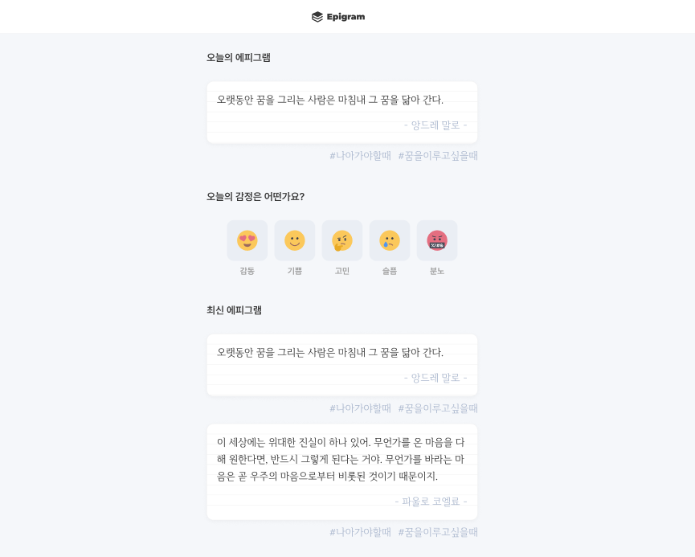

# Epigram

나의 감정을 기록하고 그에 맞는 명언을 남길 수 있는 감성 기록 플랫폼입니다. 서로의 명언을 열람하고 댓글을 통해 소통하며, 감정을 표현하고 공감할 수 있는 커뮤니티 공간을 제공합니다. 감정 통계를 통해 나의 감정 변화를 한눈에 확인할 수 있습니다.


# Tech Stack
- **Framework** : Next.js 15 with App Router
- **Language** : TypeScript
- **Styling** : Tailwind CSS
- **State Management** : Zustand
- **Authentication** : NextAuth
- **Data Fetching** : Fetch
- **Form Handling & Validation**: React Hook Form, Zod 
- **External Libraries** : Rechart, Toastify, Framer Motion
- **Deployment** : Vercel


# Features
- 오늘의 나의 감정 기록
- 명언 공유 및 댓글을 통한 감정 공유
- 캘린더와 차트를 통한 통계 제공
- 태그 기능 / 검색 기능
- 일반 로그인 및 간편 로그인 (구글/ 카카오)

# Core Features & Goals
### ✔️ Agile Development Approach
```
에자일 방식을 채택하여 반복적 개발과 빠른 피드백을 통해 지속적으로 제품을 개선하고 릴리즈했습니다. 협업을 통해 우선순위를 설정하고 사용자 요구사항을 반영했습니다.
```
### ✔️ Collaboration and Process Study
```
tldraw를 활용한 시각화을 통해 팀원들과 함께 심도 있는 스터디를 진행했습니다. 이를 통해 프로젝트에 대한 깊은 이해를 공유하고, 각 팀원의 작업을 명확히 파악하여 효율적인 협업과 코드 리뷰가 가능했습니다.
```
### ✔️ Authentication with NextAuth
```
NextAuth를 활용하여 안전하고 효율적인 인증 시스템을 구축하고, 유지보수성을 고려한 설계를 진행했습니다. NextAuth을 위해 팀원들과 공식 문서를 학습하여 시스템 설계에 반영하였습니다.
```


# Team Members

| 유주섭👑 | 강동욱         | 김은경         | 서경수         | 전병진         | 최한솔         |
|----------|----------------|----------------|----------------|----------------|----------------|
| [이미지]  | [이미지] | [이미지] | [이미지] | [이미지] | [이미지] |
